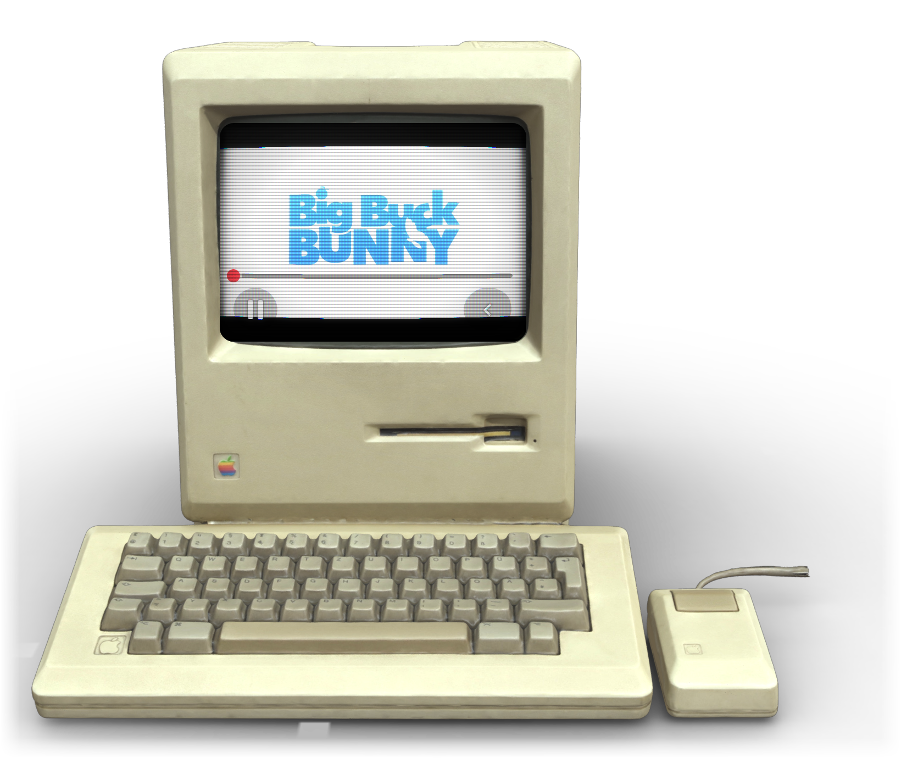
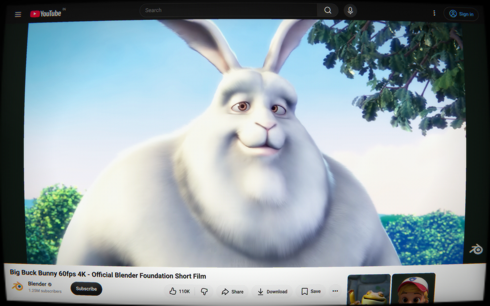

# CRT Tube 📺

YouTube with curved glass, scanlines, and a little nostalgia.

A floating Macintosh for your desktop. A CRT switch for your browser. Use either, or both.

## Install with a prompt

Paste this into your coding assistant:

```text
Install CRT Tube from https://github.com/pratikaman/crt-tube.
Ask whether I want the Mac app, Chrome extension, or both.
Clone or reuse the repository, follow its README to set up
my choice, and help me open it.
```

## Mac app

A tiny beige Macintosh that lives on your desktop — keyboard, mouse, and all.



**Install:** clone or download this repository, then run these commands in its folder.
You'll need macOS and Node.js 22.12+.

```sh
npm ci
npm run dist:mac
```

Open the `.dmg` in `release/` and drag **CRT Tube** into **Applications**.
Just want to try it? Run `npm start` after `npm ci`.

- **Click the keyboard** to search YouTube or adjust the picture. `⌘L` works too.
- **Click the mouse** to play or pause.
- **Drag the beige case** to move it. Drag the keyboard's lower-right grip to resize.
- **Click the rainbow badge** to turn the screen on or off.

`⌘+` / `⌘−` resize · `⌘0` resets size · `Esc` closes the controls

*Local builds are unsigned. Tested on Apple Silicon.*

## Chrome extension

The same CRT glow, right inside YouTube. No build step needed.



1. Clone or download this repository and extract it.
2. Open `chrome://extensions` and turn on **Developer mode**.
3. Click **Load unpacked** and choose the folder containing `manifest.json`.
4. Open YouTube and click the **CRT Tube** toolbar icon.

Flip **CRT** on, dial in the intensity, and add rolling scanlines if you're feeling nostalgic.
Keep the repository folder around while the extension is installed.

<details>
<summary>Development</summary>

The Mac app lives in `desktop/`; the extension lives at the root.
Both share `crt.js` and `crt.css`.

After `npm ci`:

```sh
npm test                       # Mac app
npx playwright install chromium
npm run test:extension          # Chrome extension
```

For an Intel Mac build, use `npm run dist:mac:intel` (untested).

</details>

---

Macintosh model by **Deutsches Museum | Digital**, CC BY-SA 4.0. [Asset credits](desktop/ASSET_CREDITS.md).
CRT inspiration: Timothy Lottes, Lucas Bebber, Alec Lownes, kube.io, and Xor.
Screenshots: *Big Buck Bunny* © Blender Foundation, CC BY 3.0.
