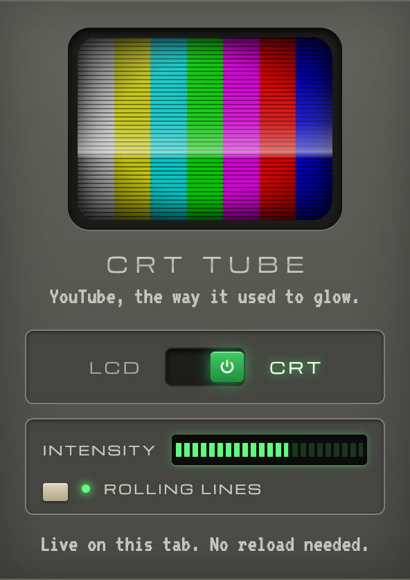

# CRT Tube 📺

A Mac app and a Chrome extension that turn YouTube into an old CRT television.
Both are maintained in this repository and can be used independently or together.

| Edition | What it does | Install |
| --- | --- | --- |
| Mac desktop app | Plays YouTube inside a floating, resizable Macintosh Plus, with its keyboard and mouse. | [Mac app installation](#install-the-mac-app) |
| Chrome extension | Adds curved glass, scanlines, phosphor and bloom to YouTube in Chrome. | [Chrome extension installation](#install-the-chrome-extension) |

The app uses its own YouTube session and local settings. The extension uses your Chrome
session and Chrome-synced settings; installing one does not install or configure the other.

## Mac app

The desktop edition puts YouTube inside a high-resolution render of a real Macintosh Plus
3D scan, complete with its keyboard, mouse, beige case, and recessed CRT. The scene comes
from [Deutsches Museum | Digital](https://sketchfab.com/3d-models/64319e3fd7dd44acb7d6d72cd8c395db)
under CC BY-SA 4.0; [asset credits](desktop/ASSET_CREDITS.md) document the source and changes.
The rendered scene is bundled locally and does not need a 3D viewer or remote assets at runtime.
The Macintosh floats directly on the desktop in a transparent, frameless window.
Drag its beige case to move it; empty space around the object lets clicks through.
Click its keyboard or press `⌘L` to open search and picture controls inside the CRT.
YouTube runs in its own sandboxed view, so its
normal player, search, captions, playlists, and browsing work without a YouTube API key.

### Install the Mac app

Requires **macOS**. To build the app yourself, you also need **Node.js 22.12 or newer**
and npm. Node.js is not needed to run an already-built app.

1. Clone this repository, or download its ZIP and extract it.
2. Open Terminal in the repository's `crt-tube` folder and run:

   ```sh
   npm ci
   npm run dist:mac
   ```

3. Open the `.dmg` created in `release/` and drag **CRT Tube** into **Applications**.
4. Open **CRT Tube** from Applications. Click the Macintosh keyboard or press `⌘L` to
   search YouTube or paste a video link.

If you already have a built `.dmg`, start at step 3. Build output is generated locally
and excluded from Git; the repository contains the app's source and build configuration.

These are local, unsigned builds; public distribution requires a Developer ID signing
certificate and Apple notarization. The local build has been checked on Apple Silicon;
Intel builds have not been tested.

### Run the Mac app without installing

From the repository root:

```sh
npm ci
npm start
```

### Mac build options

```sh
npm run pack:mac       # .app for this Mac's architecture
npm run dist:mac       # .dmg installer and .zip for this Mac's architecture
npm run dist:mac:intel # Intel Mac build
```

Builds are written to `release/`. On Apple Silicon, the unpacked app is
`release/mac-arm64/CRT Tube.app`; on Intel, it is `release/mac/CRT Tube.app`.

### TV controls

- **SEARCH:** search or paste a video, Shorts, channel, or playlist link. `⌘L` opens it.
- **KEYBOARD / DISK DRIVE:** click either part of the rendered computer to open controls
  inside its screen. Escape or Done returns to the picture. Playback continues while adjusting controls.
- **MOUSE:** click the rendered mouse button to play or pause.
- **SCREEN ZOOM:** `⌘⇧Z` enlarges the screen or restores the whole Macintosh. It is also available
  in the in-screen controls and TV menu. Video pages use the full CRT with YouTube's own player controls.
- **BROWSE:** back, forward, and YouTube home. `⌘[` / `⌘]` navigate history.
- **VOLUME / MUTE:** adjust playback volume or mute the TV.
- **PICTURE:** adjust the shared CRT shader's curvature, scanlines, phosphor, and bloom.
- **CRT / ROLL:** switch between CRT and clean picture; enable rolling scanlines.
- **POWER:** click the rainbow badge to pause and silence the TV, then click again to resume.
- **RETUNE:** reload YouTube (`⌘R`), including after a connection failure.
- **FULL SCREEN:** expand the cabinet (`⌃⌘F`). `⌘Enter` plays / pauses the video.
- **WINDOW:** drag the beige case to move it. `⌘M` minimizes, `⌘W` closes and `⌘Q` quits.
  Right-click the keyboard or mouse for quick controls. Mute uses `⌘⇧M`.
- **SIZE:** drag the diagonal grip at the keyboard's lower-right corner. The computer and
  video scale together. `⌘+` / `⌘−` make it larger / smaller; `⌘0` or double-clicking the
  grip restores the original size. The TV menu also has these controls.

Picture settings, volume, and mute are saved locally. YouTube cookies use a separate,
persistent app session. Nothing is imported from Chrome. Google may restrict sign-in from
embedded browsers; account login is not required for public videos and has not been tested.
The app needs an internet connection; it does not download videos or bypass YouTube's ads,
availability restrictions, or player behavior.

## Chrome extension

A Chrome extension that puts YouTube on a curved, glowing CRT. The whole page (video, thumbnails,
comments) bends into the tube, picks up scanlines and an RGB phosphor mask, and blooms where it's
bright. Flip it from LCD to CRT and back from the toolbar.


### Install the Chrome extension

Requires **Google Chrome**. No Node.js installation, build step, or desktop app is needed.

1. Clone this repository, or download its ZIP and extract it.
2. Open Chrome and go to `chrome://extensions`.
3. Turn on **Developer mode** in the top-right corner.
4. Click **Load unpacked** and select the repository root (`crt-tube`) — the folder
   containing `manifest.json`, not `desktop/` or `release/`.
5. Open YouTube. Pin **CRT Tube** from Chrome's Extensions menu to reach its controls easily.
   Existing YouTube tabs should pick up the effect automatically; reload a tab if needed.

Keep the extracted repository folder on your computer while using the unpacked extension.
After updating the source, click **Reload** on its card in `chrome://extensions`, then
refresh your YouTube tabs.

### Use the Chrome extension



- Click the extension icon and flip the switch: **LCD** (off) or **CRT** (on). The mini tube in
  the menu powers up with it, and every YouTube tab follows live, no reload needed. The menu
  tells you if a tab still needs one.
- **INTENSITY** scales the whole look, from a faint hint of glass to heavy scanlines and deep
  curvature. It's drawn as the green volume bars 90s TVs put on screen; the middle is the default.
- **ROLLING LINES** adds a soft band of light that sweeps down the tube, like a hum bar or a CRT
  on camera.
- The mini tube previews all of it, and open YouTube tabs follow as you drag.
- The toolbar icon shows a green **ON** badge while the tube is warm.
- The switch and both settings sync through your Chrome profile.
- The menu is dressed as the front panel of a Sony PVM monitor: graphite bezel, recessed
  control strip, a beige button that lights up power-button green.

<br clear="right">

## Shared CRT effects

- **Barrel curvature** with black tube edges. The warp is Timothy Lottes' `crt-lottes` shader
  (libretro), applied to the live page through an SVG displacement map used as a
  `backdrop-filter`, the trick from kube.io's "Liquid Glass in the Browser".
- **Aperture-grille phosphor mask and scanlines**, with **bloom** that bleeds over them, after
  Lottes' mask and bloom. The scanline and RGB-stripe idea comes from Lucas Bebber's and Alec
  Lownes' CSS CRTs.
- **Convergence fringing** toward the edges, a **vignette** (Xor's GM Shaders "Mini: CRT"),
  glass glare and rounded tube corners.
- **Power on/off**: a bright line that opens into the picture, and a collapse to a dot.
- Works on the video, in fullscreen and across YouTube's page changes. With **Reduce Motion**
  on, the power animations are skipped and the lines don't roll.

The extension targets Chrome; the Mac app uses Electron's Chromium engine. Near the screen edges the
picture is bent a few pixels away from where clicks land; turn the intensity down to flatten the
glass. The finer knobs (warp, convergence, gain, bloom, phosphor cell) are at the top of `crt.js`.

## Repository layout

| Location | Purpose |
| --- | --- |
| `desktop/` | Mac app: Electron window, Macintosh UI, bundled render, menus, media controls and app tests. |
| `package.json` / `package-lock.json` | App dependencies, build configuration and commands for both test suites. |
| `manifest.json` / `background.js` | Chrome extension manifest and background service worker. |
| `popup.html` / `popup.js` | Chrome extension's toolbar controls. |
| `crt.js` / `crt.css` | CRT renderer and effects shared by both editions. |
| `fonts/` / `assets/` | Fonts, icons and extension screenshots. |
| `test.mjs` | Chrome extension integration and pixel tests. |
| `release/` | Generated Mac app, DMG and ZIP; ignored by Git. |
| `test-results/` | Generated test screenshots; ignored by Git. |

The extension stays at the repository root so Chrome can load `manifest.json` directly.
The Mac app lives in `desktop/` and packages the shared CRT files when built.
Only the local app UI receives the preload bridge; remote YouTube pages have no Node.js
access or app IPC. Desktop effects and media controls run in an isolated JavaScript world.

## Development and testing

Run `npm ci` from the repository root to install development dependencies.

### Mac app tests

On macOS:

```sh
npm test
```

The Electron tests use a disposable profile, intercepted YouTube pages and playable media
to check navigation, isolation, CRT controls, playback, resizing, transparency,
offline recovery and saved settings.

### Chrome extension tests

```sh
npx playwright install chromium
npm run test:extension
```

These tests load the extension in Playwright's Chromium, operate its popup and check
the rendered pixels. Both test suites save screenshots to `test-results/`.

Screenshot: *Big Buck Bunny* © Blender Foundation, CC BY 3.0.
